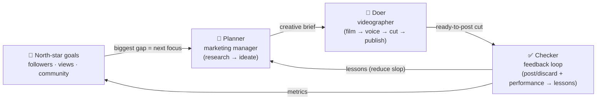

<div align="center">

# 🪐 Cosmos Claw

### Your always-on, AI-native videographer.

**Two AI agents — a marketing manager and a videographer — that run on your own
machine, 24/7, for months, chasing one ambitious goal: build a real audience.**

*Built for the **Yacht Hackathon** — by [@ComposioHQ](https://github.com/ComposioHQ), [@nebius](https://github.com/nebius), [@tavily-ai](https://github.com/tavily-ai) & [@openclaw](https://github.com/openclaw).*

[](https://x.com/i/status/2065370878519468221)

▶️ **[Watch the 60s demo on X](https://x.com/i/status/2065370878519468221)** &nbsp;·&nbsp; or play it inline below 👇

<video src="https://github.com/manas15/cosmos-claw/raw/main/assets/demo.mp4" controls muted loop playsinline width="80%"></video>

</div>

---

## The experiment

A human videographer is expensive, slow, and shoots one thing at a time. What if
you replaced the whole studio — the manager, the camera, the editor — with **two
agents that never sleep**, point them at a venue or brand, give them an audacious
goal, and just... let them run?

That's the experiment Cosmos Claw is. You set the **north-star goals**:

> 🎯 **10,000 Instagram followers · 1,000,000 TikTok views · 5,000 community interactions**

…and two agents chase them **locally, around the clock, for as long as it takes** —
researching, ideating, filming, voicing, cutting, and publishing ready-to-post
Reels and TikToks on repeat. The open question we're testing:

> **Can two AI agents, left running for months, actually build something people care about — and get *better* at it as they go?**

The bet is that they will, because the loop **learns**. Every cut you post or
discard, and every view/like/comment it earns, feeds back in — so the
unmistakable "AI slop" of the first dozen videos fades as the agents distil
durable lessons about what *this* audience actually responds to.

---

## Loops and goals

The design follows the **planner / doer / checker** loop (Boris Cherny's "loops
and goals"): a long-lived agent system isn't a single prompt — it's a cycle that
makes progress toward a measurable goal and corrects itself with real feedback.



- **Planner — the marketing manager.** GPT-4o studies the venue, locks in a
  consistent brand, and brainstorms ONE fresh campaign per cut. It is *steered by
  the goals*: whichever metric is furthest from target becomes the next focus.
- **Doer — the videographer.** Turns the brief into a 20–30s first-person POV
  reel with a unique voiceover over a mood-matched music bed, cut to 9:16.
- **Checker — the feedback loop.** You post or discard each cut and log how it
  performed; the system distils that into durable **lessons** ("avoid X, do more
  Y") that flow back into the next idea. This is the slop-reducer.

The loop stops on exactly one condition: **the goals are met.** Otherwise it
keeps going — for months if that's what it takes.

---

## Use-case & model agnostic

Nothing here is hardcoded to short-lets. A "project" is just a folder of photos
plus a free-text **use case**, so the same loop works for a **café, gym, bar,
product, event, or personal brand** — the brand voice, hashtags, and call-to-action
all derive from the dossier, not from a rental schema. The two bundled examples —
**House Rental** (`la-house-1`) and **Hacker House** (`hacker-house`) — are just
references.

The **video model is pluggable too.** Cosmos 3 is our default, but the backend is
a registry of `ClipGenerator` adapters, and `LIVEHERE_BACKEND` accepts a dotted
import path — so a forker can drop in a better model **without editing this repo**:

```bash
LIVEHERE_BACKEND=cosmos                              # default (self-hosted Cosmos 3)
LIVEHERE_BACKEND=runway                              # or luma / kling / veo / pika / ltx / wan / svd
LIVEHERE_BACKEND=openai_video                        # any OpenAI-compatible img→video server
LIVEHERE_BACKEND=mypkg.my_model:AwesomeClipGenerator # bring your own
```

Every adapter only implements `generate_clip` (+ optional `available`/`live`
health checks); the rest of the pipeline is identical regardless of model.

---

## See it in action

**1 — Raw photos in.** Drop a venue's existing images into the project. That's the
only required input. *(Here: the Alamo Square Hacker House — bedrooms, gym, coworking.)*


**2 — The marketing manager's memory.** An OpenClaw-style GPT-4o manager researches
the venue, locks in a consistent brand (positioning, audience, tone, pitch, CTA),
writes the voiceover, and picks the assets & order — the durable memory every video
is grounded on, alongside the goals and the lessons learned so far.


**3 — Ready-to-post cuts out.** The Agent Loop streams everything the videographer
does in real time. Each published cut is a ready-to-post package (video + caption +
audio + handle) that you **post or flag as slop** — and the north-star progress bars
tick up as the audience grows.


---

## The stack

| Layer | What we used |
|-------|--------------|
| 🎥 **Video model** | **NVIDIA Cosmos 3 Nano** — a *world model* (built for robotics/embodied POV), **self-deployed by us** — and a pluggable adapter for any other model |
| ⚡ **Compute** | **[Nebius AI Cloud](https://nebius.com)** — NVIDIA® **H200 NVLink** GPUs |
| 🧠 **The two agents** | **GPT-4o (vision)** — studies the photos, brands the venue, ideates each goal-driven campaign, derives lessons |
| 🔎 **Research** | **[Tavily](https://tavily.com)** — enriches each venue with real local context |
| 🔊 **Audio** | **OpenAI TTS** — a unique per-cut voiceover over a mood-matched music bed |
| 🧩 **App** | **FastAPI** Studio UI + an always-on `marketing_loop` daemon, FFmpeg for cutting/transitions |

We didn't just call a hosted API — we **stood up Cosmos 3 Nano ourselves** on
Nebius H200 NVLink GPUs (vLLM-Omni, OpenAI-compatible) and drove it end-to-end.

<sub>Shout-out to the partners: **@ship_builders · @nebiusai · @nvidia · @composio · @tavilyai · @openclaw**</sub>

---

## How it works

```
north-star goals (followers · views · community)
        │  biggest gap → focus
        ▼
  GPT-4o manager  ──→  brand dossier (positioning + durable assumptions + lessons)
        │                     │
        │                     ├─ Tavily ─→ research
        │                     └─ ideate ─→ one fresh campaign (angle · photos ·
        │                                   music · voice · caption · voiceover)
        ▼
  video model  ──→  a short first-person POV clip per beat  (Cosmos 3 by default,
   (pluggable)                                                or any adapter)
        │
        ▼
  transitions + audio  ──→  cross-fade · GPT voiceover · mood music · 9:16 reframe
        │
        ▼
  ready-to-post cut.mp4  ──→  Agent Loop feed   ──→  human: post / discard + metrics
        │                                                        │
        └──────────  loop: next idea, steered by goals + lessons ◀┘
```

| File | Role |
|------|------|
| `scripts/marketing_loop.py` | **The always-on loop**: study → ideate → film → voice → publish → learn, per venue (parallel-safe), with goal-based stopping |
| `app/marketing_agent.py` | GPT-4o marketing manager (the **Planner**): research → brand → goal-driven brief |
| `app/videographer.py` | The **Doer**: `make_reel()` — the canonical film → voice → cut → publish skill |
| `app/feedback.py` | The **Checker**: record post/discard + performance, derive durable lessons |
| `app/goals.py` | North-star goals model: targets, progress, and the biggest-gap hint for ideation |
| `app/vision.py` | GPT-4o photo analysis (asset labels + per-shot prompts) |
| `app/brand.py` | Per-venue brand dossier — memory, durable assumptions, lessons, chronicle, posts |
| `app/generation/factory.py` | Pluggable backend registry + dotted-path "bring your own model" loader |
| `app/generation/cosmos.py` | NVIDIA Cosmos 3 image→video adapter (motion → flow-shift) |
| `app/generation/openai_video.py` | Generic OpenAI-compatible img→video adapter (`VIDEO_*`) |
| `app/generation/providers/` | Optional hosted/open adapters: runway · luma · kling · veo · pika · ltx · wan · svd |
| `app/transitions.py` · `app/audio.py` | Cross-fade montage · TTS voiceover + mood music + duck-and-mux |
| `app/main.py` · `app/agent.py` | FastAPI Studio UI/API · terminal CLI (run · goal · feedback · generate) |
| `deploy/run_local.sh` · `deploy/*.plist` · `deploy/*.service` | 24/7 local daemon + launchd/systemd supervisors |

---

## Running it 24/7

The loop is the product. Point it at your projects and let it run — it is
**resume-safe** (all state lives on disk) and **self-healing** (a live endpoint
probe before every shot pauses on a network blip and resumes when it's back).

```bash
# one always-on worker per project, running concurrently, until the goals are met
python scripts/marketing_loop.py --projects la-house-1   --tag la --until-goals
python scripts/marketing_loop.py --projects hacker-house --tag hh --until-goals
```

For a true months-long run, supervise it so it survives crashes, logouts, and
reboots. The wrapper restarts the loop on any exit; launchd/systemd is a backstop:

```bash
# macOS (launchd)        — edit the absolute paths inside the plist first
cp deploy/com.cosmosclaw.loop.plist ~/Library/LaunchAgents/
launchctl load -w ~/Library/LaunchAgents/com.cosmosclaw.loop.plist

# Linux (systemd)        — edit User= and paths inside the unit first
sudo cp deploy/cosmosclaw.service /etc/systemd/system/
sudo systemctl enable --now cosmosclaw

# or just background the wrapper directly
nohup ./deploy/run_local.sh > /tmp/cosmosclaw_loop.log 2>&1 &
```

**Built for the long haul.** Dossier writes are atomic (a kill mid-write can't
corrupt memory); the append-only activity/research logs are **compacted** into a
bounded chronicle; old un-posted cuts are **pruned** off disk past a retention
cap; and a **weekly reflection** distils lessons and records a milestone — so the
agents keep a coherent long-term memory without the files growing forever. Tune it
all via `ACTIVITY_CAP`, `VERSION_RETENTION`, `REFLECT_EVERY`, … in `.env`.

### Driving it by hand

The same brain runs from the **Human Drive** / **Agent Loop** tabs in the UI, or
from the terminal:

```bash
python -m app.agent list                                   # projects + dossier status
python -m app.agent run la-house-1                         # research → brand → brief
python -m app.agent assume la-house-1 price "$245/night"   # lock a consistent fact
python -m app.agent generate la-house-1 --format reel      # render one cut via the live API

python -m app.agent goal show la-house-1                   # north-star progress
python -m app.agent goal set  la-house-1 ig_followers --target 10000
python -m app.agent goal current la-house-1 tt_views --value 25000

python -m app.agent feedback post    la-house-1 <vid>      # ✅ ship it
python -m app.agent feedback discard la-house-1 <vid> --note "voiceover felt generic"
python -m app.agent feedback perf    la-house-1 <vid> --views 5200 --likes 410
python -m app.agent feedback lessons la-house-1            # distil lessons now
```

Formats: `reel`, `tiktok` (9:16). The render canvas switches automatically.

---

## Quick start

Requires Python 3.9+ and FFmpeg.

```bash
cd LiveHere

brew install ffmpeg                 # one time

python3 -m venv .venv
source .venv/bin/activate
pip install -r requirements.txt

cp .env.example .env                # add your keys (OpenAI, Tavily, video backend)

python -m app                       # → http://127.0.0.1:8000
```

Open <http://127.0.0.1:8000>, pick a project, and watch the Agent Loop. With no
GPU configured it runs on the free local FFmpeg stub; point it at Cosmos (or any
other model) for the real thing.

---

## Running the real Cosmos 3 backend

The generation backend is swapped purely via env vars — **no code change** to the
UI or pipeline.

```bash
# .env
LIVEHERE_BACKEND=cosmos
COSMOS_API_STYLE=vllm_omni
COSMOS_BASE_URL=http://<your-gpu-host>:8000/v1
COSMOS_API_KEY=...
```

We self-hosted it on a **Nebius H200 NVLink** instance with vLLM-Omni:

```bash
vllm serve nvidia/Cosmos3-Nano --omni --host 0.0.0.0 --port 8000 --no-guardrails
```

Full deploy walkthrough (Nebius / Modal / RunPod) is in
[`deploy/DEPLOY.md`](deploy/DEPLOY.md). Cosmos can't run on Apple Silicon — keep
the GPU instance up only while generating, and tear it down when idle.

---

<div align="center">
<sub>Cosmos Claw · made with ☕ for the Yacht Hackathon · Composio × Nebius × Tavily</sub>
</div>
