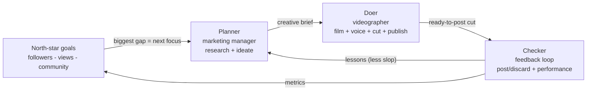
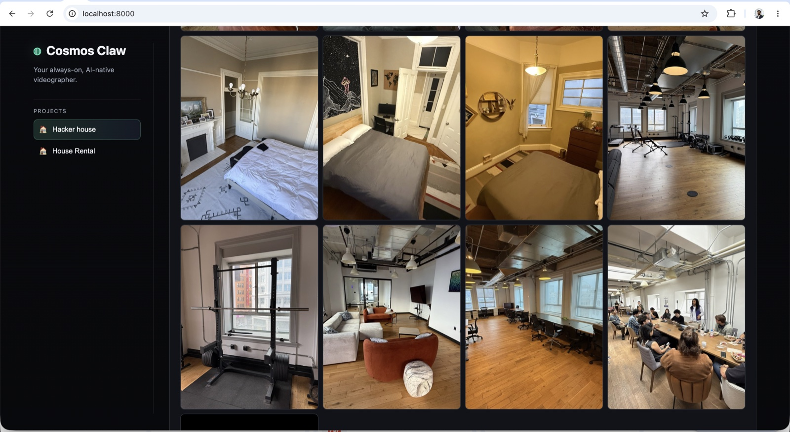
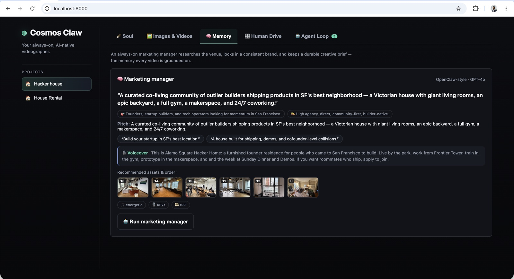
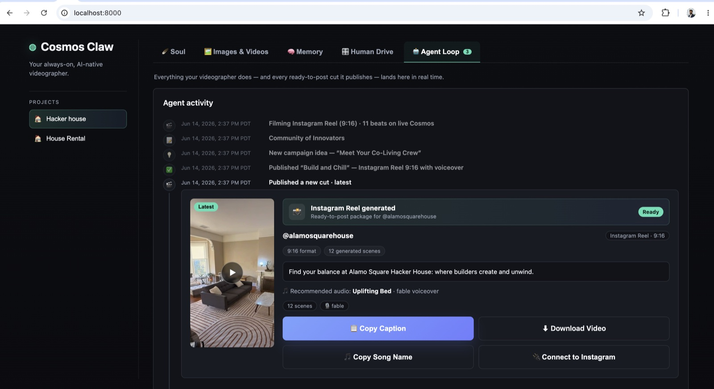
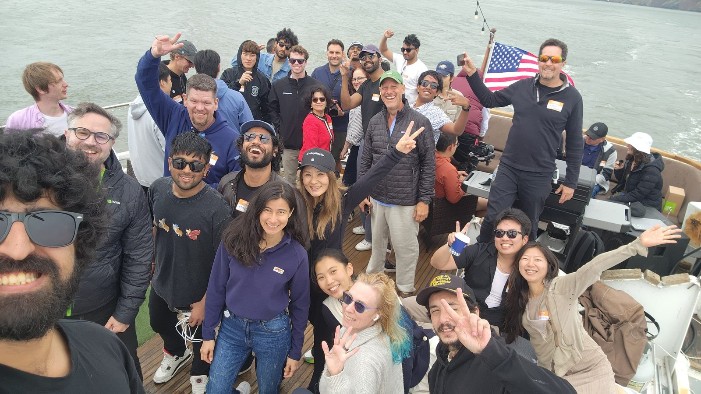

<div align="center">

# 🪐 Cosmos Claw

### An always-on, AI-native social media team running on your device.

**Point two local AI agents at a folder of photos, give them an audacious goal,
and let them research, film, voice, and publish social videos on repeat — for as
long as it takes to hit the goal.**

<p>


</p>

*Built during the hack in the high seas of SF.* Catch every minute of the action
from last Sunday on [my X](https://x.com/manassharmahere).

</div>

---

## The idea

Human social media managers are expensive and slow. Cosmos Claw replaces them
with **an AI agent pair that never sleeps**:

1. a **marketing manager** that researches a brand, locks in its identity, and
   ideates one fresh campaign at a time, and
2. a **videographer** that turns each brief into a 20–30s first-person POV reel,
   voiced and cut for IG / TikTok.

You give them a **north-star goal** (say *10k Instagram followers*) and they run
**locally, around the clock**, generating content on repeat. Every cut you post
or discard, and every view it earns, feeds back in, so the unmistakable "AI slop"
of the first dozen videos fades as the agents learn what *this* audience responds
to.

> **The open question:** can two AI agents, left running for months, build
> something people actually care about — and get *better* at it as they go?

This repo is the experiment. Fork it, point it at your own brand, swap in your
own video model, and find out.

---

## How the loop works

> *"I don't prompt Claude anymore. I have loops running that prompt Claude and
> figure out what to do. My job is to write loops."*
> — **Boris Cherny**, Head of Claude Code at Anthropic ([source](https://cobusgreyling.substack.com/p/loop-engineering))

That's the bet Cosmos Claw is built on. The design is a **planner / doer /
checker** loop: a long-lived agent system isn't one prompt, it's a cycle that
makes measurable progress toward a goal and corrects itself with real feedback.
You don't write the prompts — you write the loop and hand it a goal.



| Stage | What happens | Where |
|-------|--------------|-------|
| **Goals** | Big targets (followers / views / community). The largest remaining gap steers the next campaign. | [`app/goals.py`](app/goals.py) |
| **Planner** | GPT-4o studies the photos, locks a consistent brand, and writes one fresh brief (angle, photo order, music, voice, caption, voiceover). | [`app/marketing_agent.py`](app/marketing_agent.py), [`app/brand.py`](app/brand.py) |
| **Doer** | Films each photo into a short motion clip, cross-fades them, mixes a voiceover over a music bed, and publishes a ready-to-post cut. | [`app/videographer.py`](app/videographer.py) |
| **Checker** | You post or discard each cut and log how it did; that distils into durable lessons fed back to the Planner. | [`app/feedback.py`](app/feedback.py) |

The loop stops on exactly one condition: **the goals are met.** Otherwise it
keeps going.

---

## See it in action

**1 — Raw photos in.** A "project" is just a folder of images for any venue or
brand. That's the only required input.



**2 — The manager's memory.** A GPT-4o manager researches the brand, locks a
consistent identity (positioning, audience, tone, CTA), and keeps a durable
dossier — including the goals and the lessons learned so far — that every video
is grounded on.



**3 — Ready-to-post cuts out.** The Agent Loop streams everything in real time.
Each cut is a complete package (video + caption + audio + handle) you post or flag
as slop, and the north-star bars tick up as the audience grows.



---

## Status — what's real, and where you come in

Cosmos Claw is an honest experiment, not a finished SaaS. Here's exactly what
works today so you know what you're forking:

| Capability | State |
|------------|-------|
| Full loop on a laptop, **no GPU** (FFmpeg "stub" model: real Ken Burns motion) | ✅ works |
| Brand memory, goals, feedback, lesson-learning, the Studio UI + CLI | ✅ works |
| Photoreal first-person clips via **Cosmos 3** or any pluggable model | ✅ works |
| Use-case agnostic (café / gym / product / creator, not just rentals) | ✅ works |
| 24/7 daemon, resume-safe, self-healing, long-horizon durability | ✅ works |
| **Auto-posting** to Instagram / TikTok | 🙋 manual today — *help wanted* |
| **Auto-pulling live metrics** into goals | 🙋 manual today — *help wanted* |

Today the agents produce *ready-to-post* cuts and you publish them and log the
metrics (via the UI or `agent feedback perf`); goals advance from what you enter.
Closing those last two links — a pluggable `Publisher` and a `MetricsSource` — is
the most valuable thing a contributor can add. See [Contributing](#contributing).

---

## Quick start

Requires **Python 3.9+** and **FFmpeg**. No GPU needed to try it.

```bash
git clone https://github.com/manas15/cosmos-claw.git
cd cosmos-claw

brew install ffmpeg                 # macOS; apt-get install ffmpeg on Linux

python3 -m venv .venv
source .venv/bin/activate
pip install -r requirements.txt

cp .env.example .env                # add an OpenAI key for the GPT-4o brain
python -m app                       # → http://127.0.0.1:8000
```

Open <http://127.0.0.1:8000>, pick a project, and watch the Agent Loop. With no
video model configured it runs on the free local FFmpeg stub, so you can see the
entire loop end-to-end for $0. Add an `OPENAI_API_KEY` for real ideation and
voiceovers; point it at a video model (below) for photoreal motion.

---

## Run it 24/7

The loop is the product. Point it at your projects and let it run — it is
**resume-safe** (all state lives on disk) and **self-healing** (it probes the
video backend before every shot and pauses through a network blip).

```bash
# one always-on worker per project, in parallel, until each hits its goals
python scripts/marketing_loop.py --projects la-house-1   --tag la --until-goals
python scripts/marketing_loop.py --projects hacker-house --tag hh --until-goals
```

For a real months-long run, supervise it so it survives crashes and reboots:

```bash
# macOS (launchd) — edit the absolute paths inside the plist first
cp deploy/com.cosmosclaw.loop.plist ~/Library/LaunchAgents/
launchctl load -w ~/Library/LaunchAgents/com.cosmosclaw.loop.plist

# Linux (systemd) — edit User= and the paths inside the unit first
sudo cp deploy/cosmosclaw.service /etc/systemd/system/
sudo systemctl enable --now cosmosclaw

# or just background the wrapper
nohup ./deploy/run_local.sh > /tmp/cosmosclaw_loop.log 2>&1 &
```

**Built for the long haul:** dossier writes are atomic, append-only logs are
compacted into a bounded chronicle, old un-posted cuts are pruned off disk, and a
weekly reflection distils lessons — so memory stays coherent without files
growing forever. Tune `ACTIVITY_CAP`, `VERSION_RETENTION`, `REFLECT_EVERY` in `.env`.

### Drive it by hand

Creation is CLI-only — every research, generation, goal, and feedback action runs
from the terminal. The web UI is a read-only studio: watch the **Agent Loop**,
read the **Memory** dossier, and post/discard cuts, while the commands below do
the work (`generate` talks to a running `python -m app` server).

```bash
python -m app.agent list                                   # projects + dossier status
python -m app.agent run la-house-1                         # research → brand → brief
python -m app.agent generate la-house-1 --format reel      # render one cut

python -m app.agent goal show la-house-1                   # north-star progress
python -m app.agent goal set  la-house-1 ig_followers --target 10000
python -m app.agent goal current la-house-1 tt_views --value 25000

python -m app.agent feedback post    la-house-1 <vid>      # ship it
python -m app.agent feedback discard la-house-1 <vid> --note "voiceover felt generic"
python -m app.agent feedback perf    la-house-1 <vid> --views 5200 --likes 410
python -m app.agent feedback lessons la-house-1            # distil lessons now
```

---

## Make it yours

### Any brand, any use case

Nothing is hardcoded to rentals. A project is a folder of photos plus a free-text
`use_case`, and the brand voice, hashtags, and CTA all derive from the dossier.
The two bundled examples — **House Rental** (`la-house-1`) and **Hacker House**
(`hacker-house`) — are just references; drop in your café, gym, product, or
personal brand and the loop adapts.

### Bring your own video model

Cosmos 3 is the default, but the backend is a registry of `ClipGenerator`
adapters and `LIVEHERE_BACKEND` accepts a **dotted import path**, so you can plug
in any model without editing the repo:

```bash
LIVEHERE_BACKEND=cosmos                               # default (self-hosted Cosmos 3)
LIVEHERE_BACKEND=runway                               # or luma / kling / veo / pika / ltx / wan / svd
LIVEHERE_BACKEND=openai_video                         # any OpenAI-compatible img→video server
LIVEHERE_BACKEND=my_pkg.my_model:AwesomeClipGenerator # your own class, anywhere on PYTHONPATH
```

A complete adapter is small — implement one method:

```python
# my_pkg/my_model.py
from app.generation.base import ClipGenerator, Scene

class AwesomeClipGenerator(ClipGenerator):
    name = "awesome"

    def available(self) -> tuple[bool, str]:
        return True, "ready"          # cheap config-only check (keys present?)

    def generate_clip(self, scene: Scene, out_path: str, variant: int = 0) -> str:
        # turn scene.source_path + scene.prompt into a clip at out_path
        my_render(scene.source_path, scene.prompt, scene.duration, out_path)
        return out_path               # the rest of the loop is identical
```

That's it — the loop (vision → film → cut → voice → publish) is the same for
every model. See [`app/generation/base.py`](app/generation/base.py) for the
`Scene` fields and the optional `live()` health probe.

---

## Run the real Cosmos 3 backend

The video backend is swapped purely via env vars — no code change:

```bash
# .env
LIVEHERE_BACKEND=cosmos
COSMOS_API_STYLE=vllm_omni
COSMOS_BASE_URL=http://<your-gpu-host>:8000/v1
COSMOS_API_KEY=...
```

We self-hosted Cosmos 3 Nano on a **Nebius H200 NVLink** instance with vLLM-Omni:

```bash
vllm serve nvidia/Cosmos3-Nano --omni --host 0.0.0.0 --port 8000 --no-guardrails
```

Full deploy walkthrough (Nebius / Modal / RunPod) is in
[`deploy/DEPLOY.md`](deploy/DEPLOY.md). Cosmos can't run on Apple Silicon — keep
the GPU up only while generating.

---

## Project layout

```
app/
  marketing_agent.py   Planner: research → brand → goal-driven brief
  videographer.py      Doer: make_reel() — film → cut → voice → publish
  feedback.py          Checker: post/discard + performance → lessons
  goals.py             north-star targets, progress, biggest-gap hint
  brand.py             per-project dossier (memory, lessons, posts, chronicle)
  vision.py            GPT-4o photo analysis (labels + per-shot prompts)
  transitions.py       cross-fade montage     audio.py   voiceover + music bed
  generation/
    base.py            ClipGenerator interface + Scene
    factory.py         backend registry + "bring your own model" loader
    cosmos.py          NVIDIA Cosmos 3 adapter      stub.py   free FFmpeg fallback
    openai_video.py    generic OpenAI-compatible img→video server
    providers/         runway · luma · kling · veo · pika · ltx · wan · svd
  main.py              FastAPI Studio UI + API      agent.py   terminal CLI
scripts/marketing_loop.py   the always-on driver (study → ideate → … → learn)
deploy/                run_local.sh + launchd/systemd supervisors
```

---

## Contributing

This is meant to be hacked on. The highest-impact contributions right now close
the loop to the real platforms:

- **`Publisher` adapters** — auto-post a finished cut to Instagram (Graph API) /
  TikTok, mirroring the `ClipGenerator` plug-in pattern (with a `manual` default).
- **`MetricsSource` adapters** — poll a platform's API and call
  `goals.ingest_performance()` so the north-star bars advance on their own.
- **More `ClipGenerator` adapters** — wire up another image→video model.
- **Smarter Checker** — better lesson distillation, scheduling, A/B of hooks.

To get started: open an issue describing the change, keep modules focused and
use generic (use-case-agnostic) terms, and run `python -m unittest discover tests`
before sending a PR.

---

## Credits

Built for the **Yacht Hackathon** by
[@ComposioHQ](https://github.com/ComposioHQ),
[@nebius](https://github.com/nebius),
[@tavily-ai](https://github.com/tavily-ai) &
[@openclaw](https://github.com/openclaw).
Video model: **NVIDIA Cosmos 3 Nano**. Compute: **Nebius H200 NVLink**. Brain:
**GPT-4o**. Research: **Tavily**.



## License

[MIT](LICENSE) — fork it, ship it, build your own experiment on top of it.
