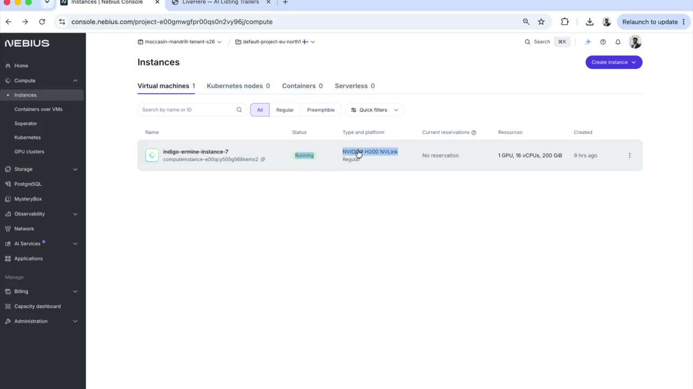

<div align="center">

# 🏠 LiveHere

### See the lease, not just the layout.

**Turn raw listing photos into a 30-second cinematic trailer that makes the deal.**

*Built for the **Yacht Hackathon** — by [@ComposioHQ](https://github.com/ComposioHQ), [@nebius](https://github.com/nebius), [@tavily-ai](https://github.com/tavily-ai) & [@openclaw](https://github.com/openclaw).*

[](https://x.com/i/status/2065370878519468221)

▶️ **[Watch the 60s demo on X](https://x.com/i/status/2065370878519468221)** &nbsp;·&nbsp; or play it inline below 👇

<video src="https://github.com/manas15/livehere/raw/main/assets/demo.mp4" controls muted loop playsinline width="80%"></video>

</div>

---

## The pitch

**30 seconds.** That's all a renter gives a listing before they swipe away.

LiveHere turns raw listing photos into a cinematic trailer that makes the deal in
those 30 seconds — **location, neighborhood, vibe, and price**, all in one
scroll-stopping cut. Drop in the photos, and out comes a property trailer a
renter actually wants to watch.

> Looking forward to expanding this on the Yacht — SF is *soooo* amazing 🌉⛵️

---

## The stack

| Layer | What we used |
|-------|--------------|
| 🎥 **Video model** | **NVIDIA Cosmos 3 Nano** — image→video, **self-deployed by us** |
| ⚡ **Compute** | **[Nebius AI Cloud](https://nebius.com)** — NVIDIA® **H200 NVLink** GPUs |
| 🔎 **Neighborhood research** | **[Tavily](https://tavily.com)** — enriches each property with real local context |
| 🎬 **Director** | **GPT-4o (vision)** — reads the photos and writes the storyboard |
| 🗺️ **Maps & info cards** | **OpenStreetMap** — location, transit & nearby spots |
| 🔊 **Audio** | **OpenAI TTS** voiceover + a soft synthesized music bed |
| 🧩 **App** | **FastAPI** + a per-listing Studio UI, FFmpeg for finishing/stitching |

We didn't just call a hosted API — we **stood up Cosmos 3 Nano ourselves** on
Nebius H200 NVLink GPUs (vLLM-Omni, OpenAI-compatible) and drove it end-to-end.
Tavily researches the surrounding neighborhood so every second of the trailer
carries the context a renter needs to say *yes*.

<sub>Shout-out to the partners: **@ship_builders · @nebiusai · @nvidia · @composio · @tavilyai · @openclaw**</sub>

---

## How it works

```
listing photos + PDF facts
        │
        ▼
  GPT-4o director  ──→  storyboard + which info beats to show
        │                     │
        │                     ├─ Tavily ─→ neighborhood research
        │                     └─ OSM ────→ map / transit / nearby cards
        ▼
  NVIDIA Cosmos 3 Nano  ──→  one photorealistic clip per beat
   (self-hosted on Nebius H200)
        │
        ▼
  decorate + assembly  ──→  grade · captions · voiceover · music · stitch
        │
        ▼
   30s landscape trailer.mp4
```

| File | Role |
|------|------|
| `app/main.py` | FastAPI server + Studio UI + generation API |
| `app/trailer.py` | GPT-4o "director" — storyboard + info-beat planning |
| `app/infocards.py` | Map / price / neighborhood cards (OpenStreetMap) |
| `app/generation/cosmos.py` | NVIDIA Cosmos 3 image→video adapter |
| `app/generation/stub.py` | Free local FFmpeg fallback generator |
| `app/decorate.py` | Shared finish: grade, captions, fades, normalize |
| `app/audio.py` | TTS voiceover + music bed + mux |
| `app/assembly.py` | Info beats + clip concatenation |
| `app/pipeline.py` | Orchestrates the whole run |

---

## Quick start

Requires Python 3.9+ and FFmpeg.

```bash
cd LiveHere

brew install ffmpeg                 # one time

python3 -m venv .venv
source .venv/bin/activate
pip install -r requirements.txt

cp .env.example .env                # add your keys (OpenAI, Tavily, Cosmos)

python -m app                       # → http://127.0.0.1:8000
```

Open <http://127.0.0.1:8000>, pick a listing, tweak the auto-filled details, and
hit **Generate**. With no GPU configured it runs on the free local FFmpeg stub;
point it at Cosmos for the real thing (below).

---

## Running the real Cosmos 3 backend

The generation backend is swapped purely via env vars — **no code change** to the
UI or pipeline.

```bash
# .env
LIVEHERE_BACKEND=cosmos
COSMOS_API_STYLE=vllm_omni
COSMOS_BASE_URL=http://<your-gpu-host>:8000/v1
COSMOS_API_KEY=...
```

We self-hosted it on a **Nebius H200 NVLink** instance with vLLM-Omni:

```bash
vllm serve nvidia/Cosmos3-Nano --omni --host 0.0.0.0 --port 8000 --no-guardrails
```

Full deploy walkthrough (Nebius / Modal / RunPod) is in
[`deploy/DEPLOY.md`](deploy/DEPLOY.md). Cosmos can't run on Apple Silicon — keep
the GPU instance up only while generating, and tear it down when idle.

---

<div align="center">
<sub>Made with ☕ for the Yacht Hackathon · Composio × Nebius × Tavily</sub>
</div>
